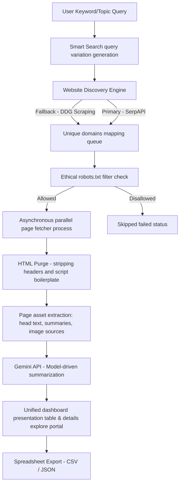

# SearchScrape 🚀

An elite, full-stack website discovery, smart web scraping, and data extraction engine. 

SearchScrape combines **high-concurrency crawling**, **ethical robots.txt checking**, and **AI-powered summarization** using **Gemini API** into a modern, gorgeous single-screen dashboard.

---

## Architecture Flow



---

## 💻 Tech Stack Deployment Environments

SearchScrape was engineered as a dual-environment application:
1. **Interactive Full-Stack Web App (AI Studio Preview):** Built using **React + TypeScript + Vite** for the frontend, and **Express + tsx** on the backend. This is optimized for cloud scaling and runs out-of-the-box inside your AI Studio container.
2. **Local Python Streamlit App:** Pre-coded Python files (`app.py`, `discovery.py`, `scraper.py`, `database.py`) allow you to run the exact same experience on your local computer using Python 3.11+.

---

## 🌍 Environment 1: Full-Stack React + Node App (AI Studio Container)

This runs on port 3000 inside the live development environment workspace of your container.

### Run in Live Development Mode
Dependencies are already configured:
```bash
# Starts Express background crawling server and mounts Vite SPA middlewares
npm run dev
```

### To Build and Run Standalone Server (Production)
```bash
# Bundles client pages into dist/ and compiles server TS into ES Modules
npm run build

# Runs production build on local node environment
npm run start
```

---

## 🐍 Environment 2: Python 3.11+ Local Streamlit App

All source modules are provided in the root directory for download or local usage.

### Prerequisites

You need Python 3.11+ installed. It is recommended to use a virtual environment:
```bash
# Create and activate virtualenv
python -m venv venv
source venv/bin/activate  # On Windows use: venv\Scripts\activate
```

### Dependency Installation

Install packages:
```bash
pip install -r requirements.txt
```

### Configure Secrets

Create a `.env` file in the root folder with:
```env
GEMINI_API_KEY="YOUR_GEMINI_API_KEY"
SERPAPI_KEY="YOUR_SERPAPI_KEY_OPTIONAL"
```

### Run local App let

Launch the Streamlit web dashboard:
```bash
streamlit run app.py
```

Streamlit will launch page buffers at: `http://localhost:8501`

---

## 🛡️ Ethical Scraping Safeguards
- **robots.txt Checking**: Automatically fetches target web properties `robots.txt` file and honors all disallowed routes before downloading page markup.
- **Polite Delays Mode**: Randomizes delays between requests on a per-domain basis to prevent overload stress queries.
- **User Agent Rotation**: Circulates client request identifiers dynamically across modern web headers.
